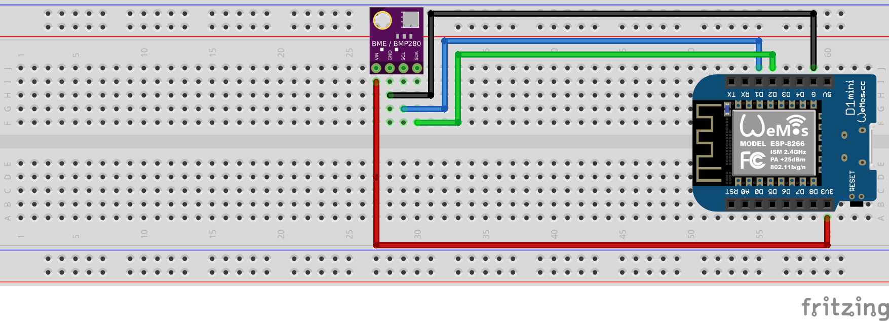

# Schülerlabor 2023 – Wetterstation mit ESP8266 & BME280
Wir bauen eine Wetterstation auf Basis eines ESP8266 Mikrocontrollers und eines [BME280 Sensors](https://www.bosch-sensortec.com/products/environmental-sensors/humidity-sensors-bme280/).

## Installation Micropython
Für unser Projekt müssen wir [MicroPython](https://micropython.org) auf dem Mikrocontroller installieren.

Die passende Version laden wir von der Seite
[micropython.org/download/ESP8266_GENERIC](https://micropython.org/download/ESP8266_GENERIC)
herunter. Auf der Kommandozeile geht dies mit dem Befehl
```bash
wget https://micropython.org/resources/firmware/ESP8266_GENERIC-20231005-v1.21.0.bin
```

Anschließend müssen wir diese Datei auf den Mikrocontroller *flashen*. Dies geht mit den Befehlen
```bash
esptool.py --port /dev/ttyUSB0 erase_flash
esptool.py --port /dev/ttyUSB0 write_flash --flash_size=detect 0 ESP8266_GENERIC-20231005-v1.21.0.bin
```


## Auslesen der Sensorwerte
Um die Werte des [BME280 Sensors](https://www.bosch-sensortec.com/products/environmental-sensors/humidity-sensors-bme280/) auszulesen, müssen wir den Sensor
- mit Spannung versorgen ($3.3 V$ und Masse),
- ihn per I2C-Bus mit dem ESP8266 verbinden.

Die nötige Spannung von $3.3V$ erzeugt die D1-Mini Platine über einen auf der Platine aufgelöteten Spannungswandler (der ESP8266 benötigt ebenfalls eine Betriebsspannung von $3.3 V$, während USB $5 V$ verwendet).
Die Verbindung per I2C erfolgt über die ESP-Pins `GPIO5` (SCL) und `GPIO4` (SDA). Um die Verwirrung größer zu machen, tragen diese ESP-Pins auf dem D1-Mini die Bezeichnungen `D1` bzw. `D2`. 

Die nötige Verschaltung ist daher wie folgt:


## Programmablaufplan für das Auslesen der Sensorwerte

Unser Programm `client.py` soll 
- sich nach dem Start mit dem WLAN verbinden (das benötigen wir später, um unsere Daten in die "Cloud" zu schreiben),
- den Sensor initialisieren, und dann
- regelmäßig alle 30 Sekunden die Sensordaten lesen und ausgeben.

Früher (zu Zeiten, als PCs noch so
 aussahen) hat man Programme über 
[Programmablaufpläne nach DIN 66001](https://de.wikipedia.org/wiki/Programmablaufplan) dokumentiert.

> <div style="padding: 2ex;">
> <span style="font-weight: bold;">Aufgabe</span>: 
> Erstellt zu dem oben skizzierten Ablauf einen <a href="https://de.wikipedia.org/wiki/Programmablaufplan">Programmablaufplan</a>.
> </div>

## MQTT-Verbindung
Wir wollen die Daten nun "von außen" – also ohne USB-Verbindung zum ESP8266 Board – auslesen.
Die Idee ist folgende:
1. Wir verbinden den ESP8266 mit dem Internet. Dazu verwenden wir die WLAN-Schnittstelle des ESP8266 und verwenden uns mit einem Access-Point.
2. Wenn wir eine Verbindung zum Internet haben, senden wir die Daten über das [MQTT Protokoll](https://de.wikipedia.org/wiki/MQTT) an einen **MQTT Broker**.
   Für erste Tests verwenden wir dabei den öffentlichen Broker `broker.hivemq.com`.

Dafür benötigen wir zwei Dateien:
- Die Datei `umqttsimple.py` implementiert das MQTT-Protokoll,
- Die Datei `client.py` verbindet sich mit dem Broker und sendet testweise jede Sekunde eine Nachricht an den Broker.

## Anzeige der Nachrichten
Zum Anzeigen der Nachrichten verwenden wir zunächst den [MQTT Browser Client](http://www.hivemq.com/demos/websocket-client/).

